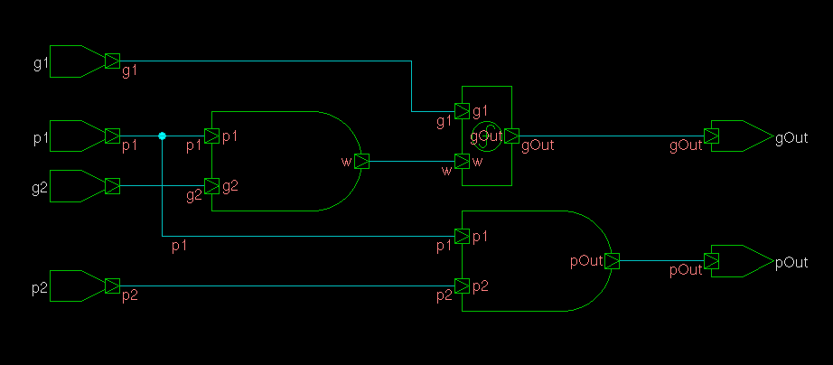
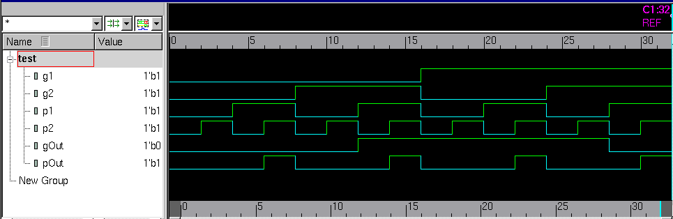
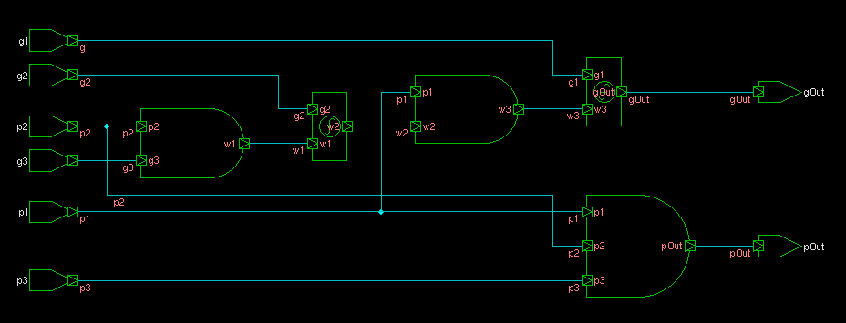
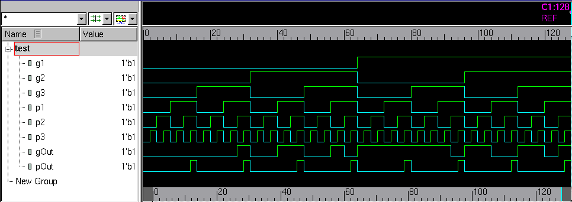
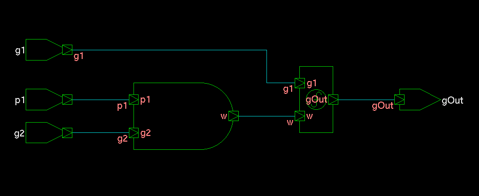
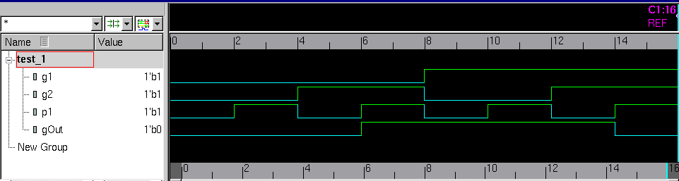
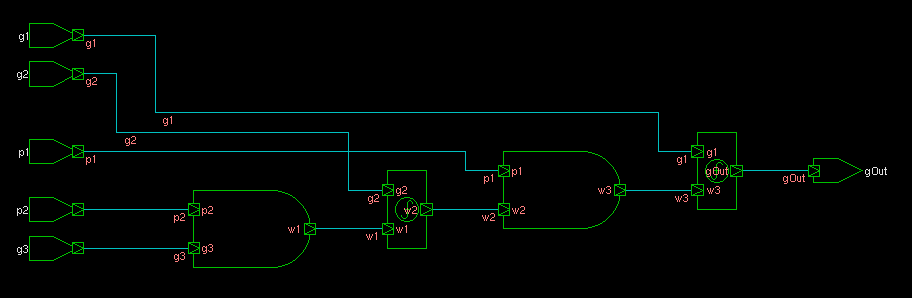
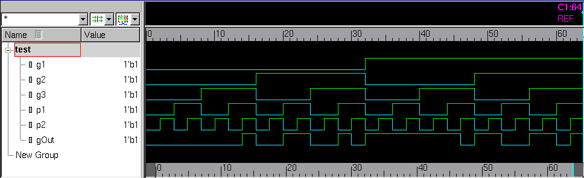

# Schematics and Waveforms 

### Valency-2 Black Cell

***
### Valency-3 Black Cell

***
### Valency-2 Gray Cell

Schematic                                                            | Test Waveform
:-------------------------------------------------------------------:|:------------------------------------------------------------------------:
 | 

***
### Valency-3 Gray Cell

 