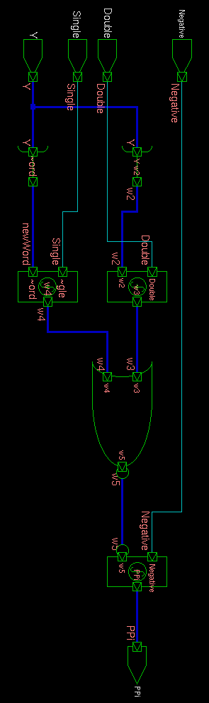

# Schematics and Waveforms 

### Valency-2 Black Cell

***
### Valency-3 Black Cell

***
### Valency-2 Gray Cell

***
### Valency-3 Gray Cell

 

***
### Radix-4 Booth-Encoder 

Screenshot                                                           | Book 
:-------------------------------------------------------------------:|:------------------------------------------------------------------------:
 | .png)

***
### Radix-4 Booth-Select 

Screenshot                                                           | Book 
:-------------------------------------------------------------------:|:------------------------------------------------------------------------:
 | .png)
 | 

<!--- This is a comment using standard html tags!

One way to put images side by side is to form a table:

Schematic                                                            | Test Waveform
:-------------------------------------------------------------------:|:------------------------------------------------------------------------:
 | 

The other way is to just put both in the same line, however if the images are too big it will not work.
-->